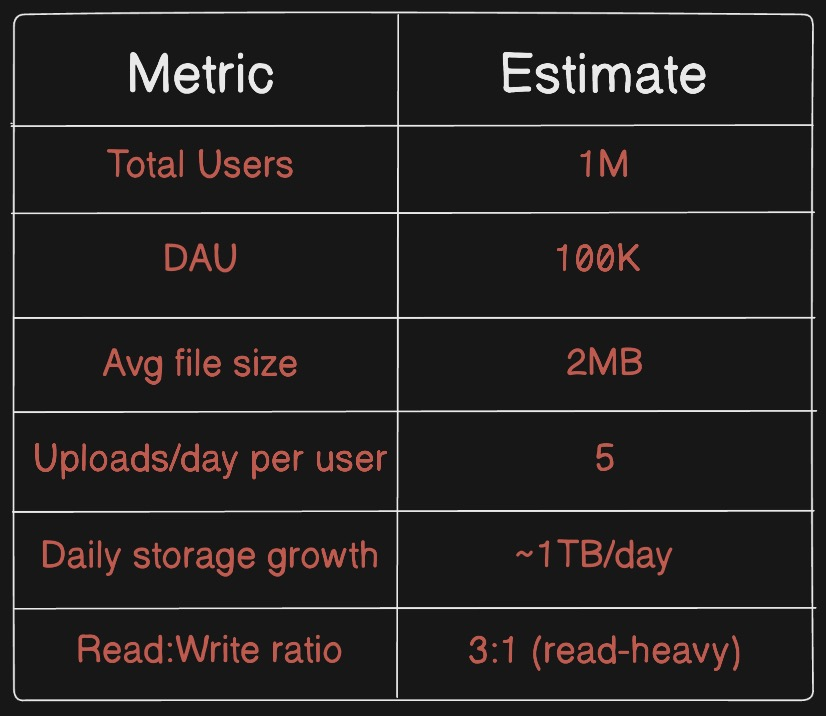
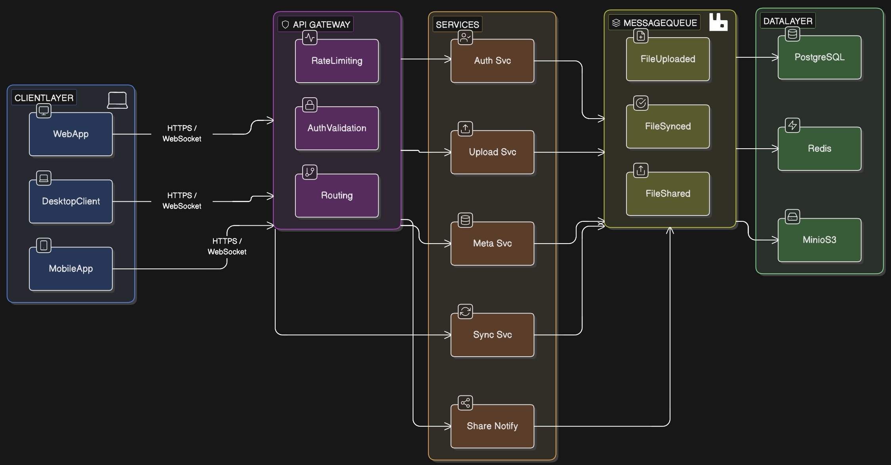

# DriftBox — System Framework

> A personal cloud storage system inspired by Dropbox, built for learning distributed systems, file sync, and scalable architecture.

## 1. Project Overview

**DriftBox** is a cloud file storage and sync system that allows users to:
- Upload and download files from anywhere
- Automatically sync files across multiple devices
- Version files and restore previous states
- Share files and folders with other users

**Core Design Philosophy:**
- Files are split into **chunks** for efficient upload, deduplication, and partial sync
- Only **changed chunks** are synced (delta sync) — not entire files
- The system is built around **eventual consistency** with conflict resolution

---

### Functional Requirements
- User registration, login, and authentication
- Upload files (single + chunked for large files)
- Download files via secure, time-limited URLs
- Automatic file sync across devices
- File versioning (view and restore previous versions)
- Share files/folders with permissions (view / edit)
- Folder hierarchy support
- File search by name and metadata

### Non-Functional Requirements
- **Availability:** 99.9% uptime target
- **Durability:** No data loss (replicated storage)
- **Scalability:** Designed to handle millions of users
- **Security:** Encrypted at rest and in transit (TLS + AES-256)
- **Low Latency:** Fast uploads via chunking + parallel transfers

### Capacity Estimates (baseline)

---

## 2. Architecture Overview

---

## 3. Core Services

### 3.1 Auth Service
- Handles user registration and login
- Issues **JWT access tokens** (short-lived, 15min)
- Issues **Refresh tokens** (long-lived, 30 days, stored in DB)
- OAuth2 support (Google login)
- Responsibilities: signup, login, logout, token refresh

### 3.2 Upload Service
- Accepts file chunks from the client
- Each chunk is **4MB** by default
- Computes **SHA-256 hash** of each chunk for deduplication
- If hash already exists in storage then skip upload (dedup hit)
- Stores chunks in **MinIO** object storage
- Fires `file.uploaded` event to RabbitMQ on completion
- Supports **resumable uploads** (tracks which chunks are done)

### 3.3 Metadata Service
- Manages the logical file/folder structure per user
- Stores: file name, size, type, folder path, version history, chunk references
- Backed by **PostgreSQL**
- Hot metadata (recently accessed files) cached in **Redis**
- Handles versioning — each upload creates a new version record

### 3.4 Sync Service
- Listens for `file.uploaded` and `file.changed` RabbitMQ events
- Determines which other devices of the user need updating
- Notifies those devices via **WebSocket** connections
- Client then fetches only the changed chunks (delta sync)
- Handles **conflict detection:** if two devices edit the same file then creates a conflict copy.

### 3.5 Share & Notification Service
- Manages shared file/folder permissions (read / write)
- Generates **signed share links** with expiry
- Sends notifications: email, in-app, or webhook
- RBAC (Role-Based Access Control) for shared resources

### 3.6 API Gateway (NGINX)
- Single entry point for all clients
- Responsibilities:
  - JWT validation
  - Rate limiting (per user/IP)
  - Request routing to correct microservice
  - SSL termination

