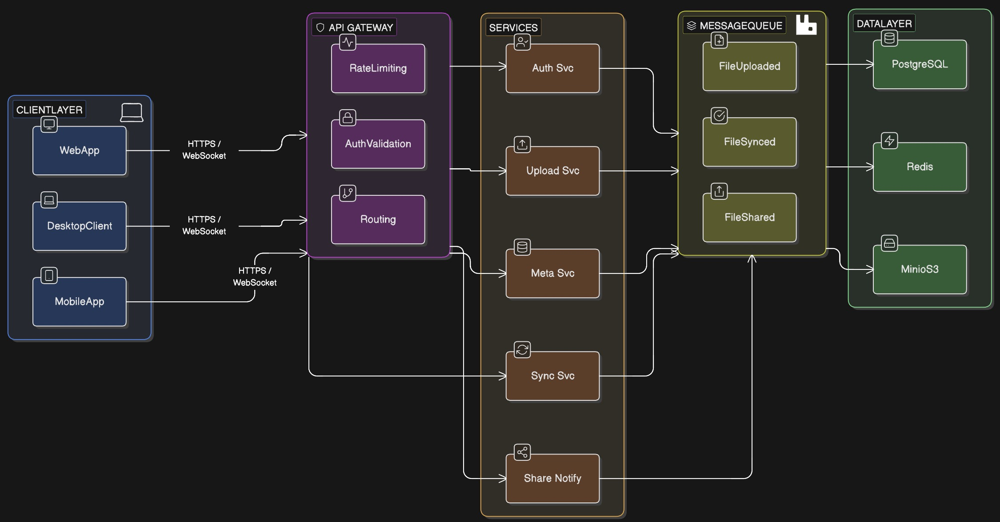
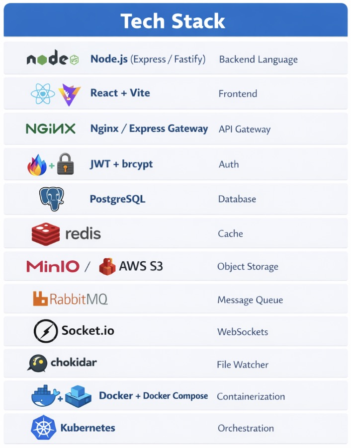

# DriftBox

A personal cloud storage and file sync system built as a deep dive into distributed systems, microservices architecture, and scalable backend design. Inspired by Dropbox.

---

## What It Does

- Upload and download files from anywhere via chunked, resumable transfers
- Automatically sync file changes across multiple connected devices in real time
- Version every file and restore any previous state
- Share files with other users via signed links with optional expiry
- Search files by name across your entire file system

## Architecture

Five independent microservices behind an NGINX API gateway, communicating via RabbitMQ for async events and WebSockets for real-time device sync.



## Services

### Auth Service
Handles registration, login, logout, and token management. Issues short-lived JWT access tokens (15 minutes) and long-lived refresh tokens (30 days) stored in PostgreSQL. Refresh tokens are rotated on every use.

### Upload Service
Accepts files as 4MB chunks. Each chunk is SHA-256 hashed before storage — if the hash already exists in MinIO, the upload is skipped entirely (content-addressed deduplication). Upload sessions are tracked in Redis. On completion, a database transaction records the file and version, and a `file.uploaded` event is published to RabbitMQ.

### Metadata Service
Manages the logical file and folder structure per user. Handles file listing with pagination, single file retrieval, soft deletion, version history, version restore, and name search. Hot metadata is cached in Redis with a 60-second TTL. Version restore runs inside a Postgres transaction to guarantee consistency.

### Sync Service
Consumes `file.uploaded` and `file.shared` events from RabbitMQ. Maintains persistent WebSocket connections per user, grouped by device. When an event arrives, it pushes a real-time notification to all connected devices belonging to that user. Each user's devices are isolated — events never leak across users.

### Share Service
Generates signed share links with optional expiry. Public link access requires no authentication. Link management (create, revoke, list) requires auth and is scoped to the owning user - you cannot revoke someone else's link. Publishes a `file.shared` event on creation.

---

## Tech Stack


---

## How Upload Works

1. **Init** — Client sends filename, size, and mime type. Server calculates chunk count, creates a Redis session, returns `sessionId` and `totalChunks`.
2. **Chunk** — Client sends each 4MB chunk individually with its index. Server hashes the chunk, checks MinIO for a duplicate, uploads if new, and updates session progress.
3. **Complete** — Client signals completion. Server verifies all chunks are present, runs a Postgres transaction to record the file and version, clears the Redis session, and publishes `file.uploaded` to RabbitMQ.

## How Download Works

The server never proxies file bytes. Instead, it retrieves the ordered list of chunk storage paths from the file's version record and asks MinIO to generate a time-limited signed URL per chunk. The client receives the URL list and downloads directly from MinIO, then reassembles the chunks in order.

---

## Database Schema

Five tables: `users`, `files`, `file_versions`, `chunks`, `refresh_tokens`.

Files are soft-deleted (an `is_deleted` flag) so version history is preserved. Each `file_versions` row stores an ordered array of chunk IDs rather than copying chunk data, so deduplication works across versions.

---

## Monitoring

Prometheus scrapes a `/metrics` endpoint on every service. Four Grafana dashboards are configured:

- **Service Overview** — request rate, error rate, p95 latency across all services
- **Upload Pipeline** — chunk throughput, deduplication hit rate, upload duration histogram
- **Sync Health** — active WebSocket connections, RabbitMQ queue depth, sync lag
- **Infrastructure** — pod CPU and memory, database connections, Redis memory usage

AlertManager is configured for high error rate, RabbitMQ queue backlog, pod memory pressure, and service downtime.

---

## Testing

Every service has unit tests and integration tests written with Jest and Supertest.

Unit tests mock all infrastructure (database, Redis, RabbitMQ, MinIO) and test controller logic in isolation. Integration tests fire real HTTP requests through the full Express middleware stack with mocked infrastructure, verifying routing, auth guards, and response shapes.


Coverage threshold enforced at 80% lines and functions, 70% branches across all services.

---

## Running Locally

Prerequisites: Docker Desktop with Kubernetes enabled.

```bash
# Start all infrastructure
docker-compose up -d

# Apply Kubernetes manifests
kubectl apply -f k8s/

# Verify all pods are running
kubectl get pods
```

Each service reads configuration from environment variables. See `.env.example` in each service directory.

---

## CI/CD

GitHub Actions runs on every push and pull request:

- Lint and test all five services in parallel
- Build and push Docker images on merge to `main`
- Deploy to staging automatically on merge to `main`
- Deploy to production on tagged releases only

Each service uses a multi-stage Dockerfile — a builder stage installs dependencies, the final stage copies only what is needed into a clean Alpine image.

---

## Capacity Design

Designed to handle:

- 50 million total users, 10 million daily active
- 10 petabytes of total stored data
- 10 million file uploads per day
- Average file size of 10MB, chunked at 4MB

Estimates informed the choices of chunked transfer, content-addressed deduplication, Redis caching in the metadata service, and async sync via RabbitMQ rather than synchronous calls.